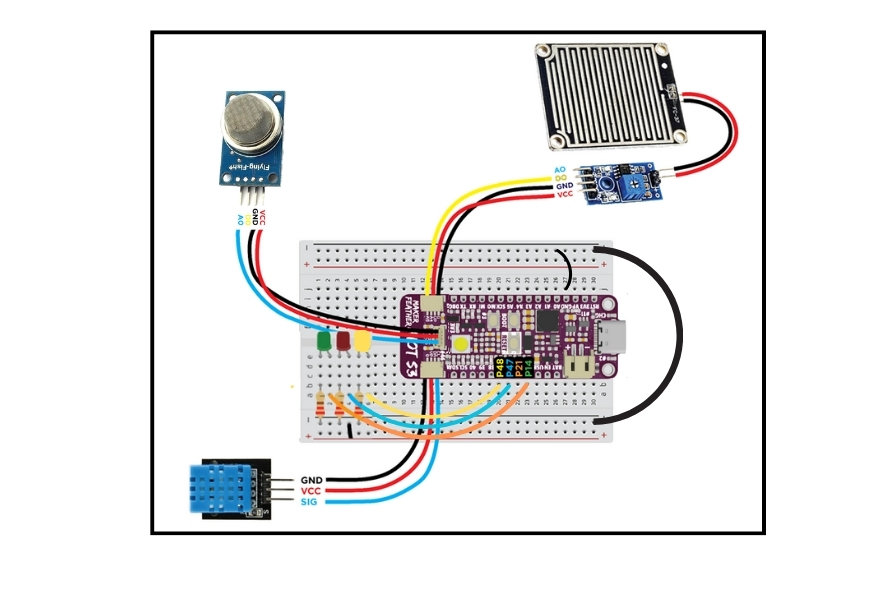

# EnviroAlert (Smart Fire,Rain and Temperature Monitoring and Alert System for Lecture Hall)

## Project Description  

The **Enviro Alert** is an IoT-based solution designed to monitor and alert on fire, rain, and temperature conditions outside of the lecture halls and buildings. Using a combination of sensors like MQ2 for smoke, DHT11 for temperature and humidity, and a rain sensor, this system provides real-time data and early warnings. The system integrates with cloud platforms to ensure timely alerts and facilitate remote monitoring.

## Contributions to UN Sustainable Development Goals

The EnviroAlert contributes to:
- **SDG 3: Good Health and Well-being**: Ensuring a safer learning environment and promoting health through early detection of risks.
- **SDG 4: Quality Education**: Supporting uninterrupted education by maintaining a safe environment.
- **SDG 13: Climate Action**: Supporting climate action through environmental monitoring.

---

## Key Features 
- **Fire Detection**: Real-time monitoring of smoke levels using the MQ2 sensor to detect potential fire hazards.
- **Temperature Monitoring**: Continuous tracking of temperature changes outside of the lecture hall using the DHT11 sensor, with alerts for extreme temperatures.
- **Rain Detection**: Monitoring for rain conditions with the rain sensor, providing immediate alerts for the audience in the lecture hall.
- **LED Alert System**: Visual alerts through red, yellow, and green LEDs for fire, high temperature, and rain events.
- **Cloud Data Integration**: Publishing sensor data to the cloud for remote monitoring, analysis, and historical data access.
- **Real-Time Alerts**: email notifications sent to administrators when critical thresholds (fire, temperature, rain) are crossed.

---

## Prerequisites  
Ensure the following libraries and tools are installed:  

### Software Requirements
- **Arduino IDE**
  - Go to the **Sketch > Include Library > Manage Libraries**
  - Install these libraries:
    - **Arduino_JSON** by Arduino
    - **EspMQTTClient** by Patrick Lapointe
    - **Adafruit NeoPixel** by Adafruit
    - **DHT sensor library** by Adafruit
    - **PubSubClient** by Nick O'Leary
   

  - Go to the **File > Preference > Settings > Additional boards manager URLs** 
    - Put the link below into the **Additional boards manager URLs**
    - https://raw.githubusercontent.com/espressif/arduino-esp32/gh-pages/package_esp32_index.json

  - Go to the **Tools > Boards > Boards Manager**
    - Install **esp32** by Espressif Systems

  - Go to [GitHub - CytronTechnologies/IoT-Kit-V-One](https://github.com/CytronTechnologies/IoT-Kit-V-One) and **download the ZIP file** for this IoT kit.
    - Go to **Sketch > Include Library > Add ZIP Library** and choose the ZIP file that have been downloaded.

- **V-One Account**
  - Login to the account
  - Go to **Device Manager > Device Types** and add these device types:
    - DHT11 IoT Kit
    - MQ2 sensor IoT Kit
    - Rain sensor IoT Kit
    - Led (Red,Green,Yellow)
  - Go to **Device Manager > Gateways** and create a new gateway
  - Go to **Device Manager > Devices** and add each of the devices mentioned before
    - **Note:** Make sure each of these devices uses the newly created gateway

### Hardware Requirements
- **Maker Feather AIoT S3 Microcontroller** 
- **Breadboard**
- **Jumper Wires**
- **DHT11 Sensor** (Temperature and Humidity)  
- **MQ2 Sensor** (Smoke concentration and Fire measurement)  
- **Rain Sensor**  (Rain Detection)
- **3 LED (Green, Yellow, Red)** (For Rain, High Temperature and Fire indicator)  
---

## Setup Guide  

### 1. Hardware Setup 

1. Connect the sensors and actuators to the Maker Feather S3 as per the circuit diagram. 
    - **Note:** In the `/img` folder, there is a full diagram as well as connection guide in case some wiring in the diagram is not clear
2. Power up the microcontroller and ensure all connections are secure.

### 2. Software Setup  
1. Download this repository into zip file or copy the coding into the Arduino IDE
2. Navigate to the V-One libraries and modify the WiFi and gateway credentials.
    - It usually located at **Documents\Arduino\libraries\IoT-Kit-V-One-main** 
    - Open the **vonesetting** file using Notepad or any text editor.
    - Change the **WiFi SSID**, **WiFi Password**, **Gateway Access Token** and **Gateway ID** according to your credentials.
    - **Note:** Gateway Access Token and Gateway ID can be found in the V-One platform at **Device Manager > Gateways**.

---

## How to Run  
1. Open Arduino IDE  
2. Copy the code into the Arduino IDE or open the CPC357_Project_Code.ino file. 
3. Change the Device IDs in the code according to your own devices.
    - **Note:** These Device IDs can be found in the V-One platform at **Device Manager > Devices**
4. Change the pins according to your own hardware setup.
5. Connect the Maker Feather AIoT S3
6. Choose these corresponding board and COM port before uploading the code:
    - **Tools > Boards > esp32 > Cytron Maker Feather AIoT S3**
    - **Tools > Port > Your COM port**
      - **Note:** For the COM port, sometimes it will show a random name of an ESP32 board. Just ignore that name and just select that port.
    - **Tools > USB Mode > Hardware CDC and JTAG**
7. Upload the code

---

## Testing  
- Verify sensor readings individually before integrating them into the main system.  
- Simulate Environment conditions by varying Rain detection , smoke concentration and Temperature reading to ensure proper detection and alerts.  
- Test if the 3 LED (Green, yellow and Red) light up when the serial monitor reading exceed threshold

---

## Sustainable Development Goals (SDG) Alignment  
This project supports **SDG 3: Good Health and Well-being**,**SDG 4: Quality Education** and **SDG 13: Climate Action** by ensuring a safer learning environment, promoting health through early detection of risks, and supporting climate action through environmental monitoring.
---

## Contributions  
We welcome contributions! Please submit pull requests or report issues for improvement.
